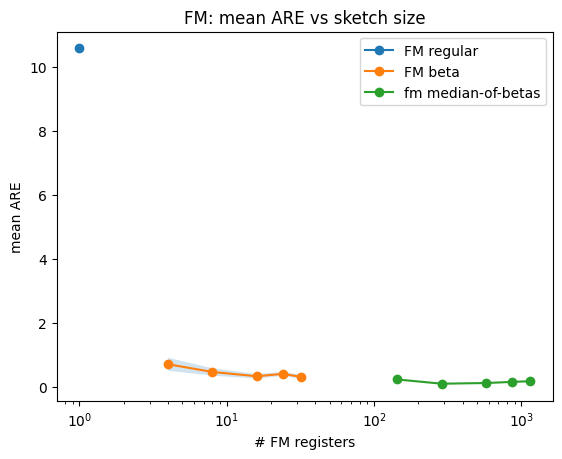
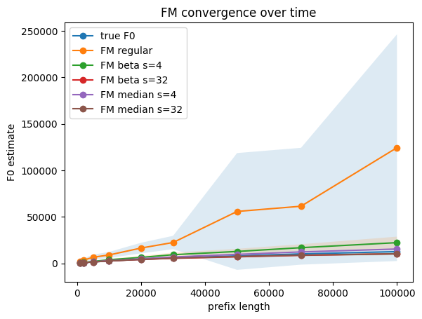
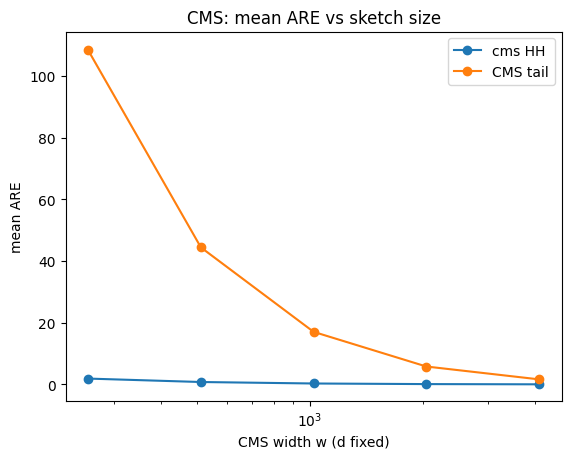
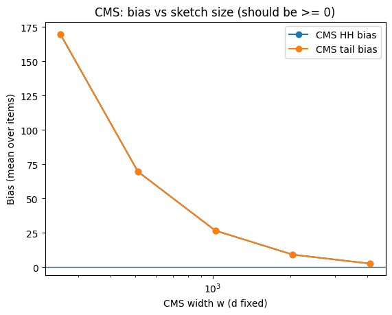
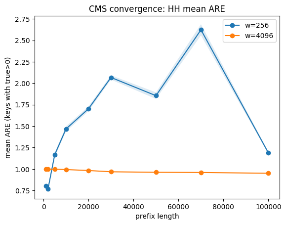
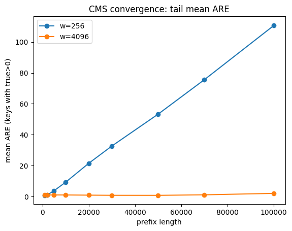

# Streaming Sketches: Flajolet–Martin (FM) and Count–Min Sketch (CMS)

This project is a hands-on experimental study of classic **streaming sketches** - randomized algorithms designed for **single-pass**, **sublinear-memory** analytics on high-volume data streams. The focus is on *experiencing* (empirically) how sketch size affects accuracy, bias, variance, runtime, and convergence behavior.

We implement:
- **Flajolet–Martin (FM)** for estimating the number of **distinct elements** $F_0$
- **Count–Min Sketch (CMS)** for estimating **item frequencies** $f(x)$

> Completed during my **MSc in Data Science & Machine Learning at Reichman University**, in the frame of the **Data Streaming Algorithms & Online Learning** course.  
> **Grade:** 100/100 — Feedback: “Excellent Work”.

---

## Project Goal

Given a data stream of length $N$, we want to:
1. Estimate the **distinct count** $F_0$ using FM (three variants).
2. Estimate **frequencies** $f(x)$ using CMS.
3. Empirically evaluate how sketch parameters affect:
   - accuracy (ARE / RRMSE)
   - bias
   - normalized variance
   - convergence over time (prefix length)
   - memory and runtime tradeoffs

---

## Requirements

- Implement:
  - **FM** in three versions: regular, beta/average, and median-of-betas
  - **Count–Min Sketch (CMS)**
- Data requirements:
  - stream size $N \ge 100{,}000$
  - number of unique elements $F_0 \ge 10{,}000$
- Statistical significance:
  - at least **50 trials** per estimator configuration
- Experiments:
  - sweep multiple sketch sizes and plot:
    - accuracy, bias, and normalized variance vs sketch size
    - convergence over time (prefix length)
  - compute theoretical $(\epsilon,\delta)$ guarantees for **$\ge 95\%$** success probability
- Efficiency:
  - vectorized / efficient updates where possible
- Memory:
  - show memory usage via proxy measures (e.g., number of registers/counters)

---

## Data Source

We use an **existing dataset**: WikiText-2 (raw, train split) to build a token stream:
- basic preprocessing (lowercasing, stripping edge punctuation)
- mapping tokens $\to$ integer IDs

The notebook enforces and prints:
- $N \ge 100{,}000$
- $F_0 \ge 10{,}000$

---

## Methods

### Flajolet–Martin (FM) — Distinct Counting ($F_0$)

FM hashes each *distinct key* to $[0,1)$ and keeps minimum statistics.

We implement:
- **Regular FM** (single register)
- **FM Beta (Average-of-Minima)** using $s$ registers
- **FM Final (Median-of-Betas)** using $t$ independent beta estimators

Key idea: averaging and taking a median reduce the influence of extreme outliers that can appear when a minimum hash value is very close to $0$.

---

### Count–Min Sketch (CMS) — Frequency Estimation ($F_1$)

CMS maintains a $d \times w$ counter table. For a key $x$:

$$
\tilde f(x) = \min_{i \in \{1,\dots,d\}} C_i[h_i(x)].
$$

CMS **never underestimates** (collisions only increase counters):

$$
\tilde f(x) \ge f(x).
$$

The notebook includes a sanity check validating this property empirically.

---

## Why We Evaluate CMS on Heavy Hitters (HH) and Tail

CMS guarantees are primarily **additive**:

$$
\tilde f(x) \le f(x) + \epsilon F_1
\quad \text{with probability } \ge 1-\delta,
$$

where $F_1=\sum_x f(x)$ equals the stream length.

Because the error term is additive, the *relative* impact differs by regime:
- **Heavy hitters (HH):** large $f(x)$, so $\epsilon F_1/f(x)$ is typically smaller.
- **Tail:** small $f(x)$, so the same additive error can yield very large relative error.

We therefore evaluate CMS separately on:
- **HH:** top-$K$ keys by true frequency
- **Tail:** $K$ randomly sampled non-HH keys

---

## Sketch Sizes and Theory (95% Success)

### CMS parameters
We use depth $d=5$:

$$
\delta = 2^{-d} = 2^{-5} = 0.03125
\;\Rightarrow\;
1-\delta \approx 0.96875 \;\ge 95\%.
$$

We sweep widths:

$$
w \in \{256, 512, 1024, 2048, 4096\},
$$

with the standard scaling:

$$
\epsilon \approx \frac{2}{w}.
$$

### FM Final (Median-of-Betas) confidence boosting
With $t$ independent beta estimators, a Chernoff-style bound yields:

$$
\delta \approx e^{-t/12}.
$$

Choosing $t=36$ gives:

$$
\delta \approx e^{-36/12}=e^{-3}\approx 0.0498
\;\Rightarrow\;
1-\delta \approx 0.9502 \;\ge 95\%.
$$

---

## CMS Folding Trick (Build Once, Reuse Many Widths)

To avoid rebuilding CMS from scratch for every width, we:
1. build once at $w_{\max}=4096$
2. derive smaller widths by folding

### Important detail: High-bit indexing
We map a 64-bit hash $h$ into $[0,w)$ using the top $k=\log_2(w)$ bits:

$$
\text{idx} = h \gg (64-k)
$$

### Folding under high-bit indexing
Let $\text{factor} = w_{\max}/w$. Then each bucket at width $w$ corresponds to a **contiguous block** of $\text{factor}$ buckets at width $w_{\max}$, implemented by:
- reshape into $(w, \text{factor})$
- sum within each block

---

## Key Figures

The plots below are exported from the notebook and stored under `figures/`.

### 1) FM Accuracy vs Sketch Size (Regular vs Beta vs Median-of-Betas)

### 2) FM Convergence Over Time (Prefix Length)

### 3) CMS Accuracy vs Width (HH vs Tail)

### 4) CMS Bias vs Width (Should Be $\ge 0$)

### 5) CMS Convergence Over Time (HH Mean ARE, $w=256$ vs $w=4096$)

### 6) CMS Convergence Over Time (Tail Mean ARE, $w=256$ vs $w=4096$)

---

## Conclusions

### FM (Distinct Counting)
- The **regular** FM estimator is extremely unstable: rare very small minimum-hash values make the inverse explode. This appears empirically as very high mean ARE / RRMSE, huge positive bias, and extremely large normalized variance.
- The **beta (average-of-minima)** variant improves accuracy as the number of registers $s$ increases, reducing variance and bringing the bias closer to 0.
- The **median-of-betas (final)** estimator is the most robust: taking the median across $t$ independent beta estimators suppresses outliers and yields the most stable convergence over time, at the cost of higher memory and runtime.

### CMS (Frequency Estimation)
- CMS **never underestimates** $\tilde f(x)\ge f(x)$, which is confirmed by the notebook’s sanity check.
- CMS exhibits **positive bias** due to collisions, and this bias decreases as width $w$ increases.
- Tail items have much larger **relative** errors than heavy hitters, which matches the **additive** error guarantee $\tilde f(x)\le f(x)+\epsilon F_1$: for small $f(x)$, the ratio $\epsilon F_1/f(x)$ can be large.
- In the convergence plots, small widths (e.g., $w=256$) accumulate collision noise quickly, while larger widths (e.g., $w=4096$) remain far more stable—especially for tail keys.

### Final Takeaway
- **FM:** regular is a useful baseline but not practical; beta improves significantly; median-of-betas provides the best robustness.
- **CMS:** works well for heavy hitters and moderate counts, but tail relative error can be large unless width is sufficiently large, reflecting the additive nature of its guarantees.

---

## Author

**Noor Nashef**  
MSc Data Science & Machine Learning student, Reichman University 
BSc in Information Systems Engineering specialized in Machine Learning, Technion

